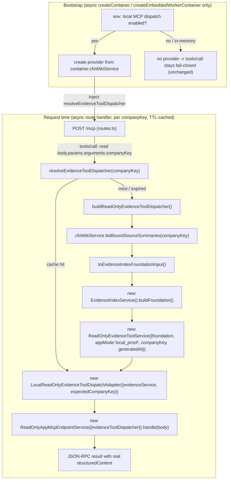

# Plan: Productionize local read-only MCP dispatch (Pocket CFO)

## Context

The `/mcp` endpoint answers `initialize` / `ping` / `tools/list`, but every `tools/call`
returns the fail-closed refusal because no evidence dispatcher is wired in. This was a
**deliberate boundary**, not an oversight: `plans/FP-0111-...-default-local-evidence-dispatch-wiring.md`
shipped the optional `readOnlyAppMcpEndpointService` container port and the route pass-through,
while explicitly deferring "DB query implementation" and "route-level evidence service
construction" to a later slice. This plan is that later slice.

Goal (per your scope): wire the **local read-only** path so the 7 evidence tools return real
DB-backed evidence, keeping the fail-closed / loopback-only safety boundary. Remote hosting,
OAuth, Apps SDK resources, and ChatGPT-app submission stay out of scope (later phases, already
sequenced in `plans/FP-0144`, `FP-0162`+).

### What verification of the code changed vs. the original draft

1. **The "net-new adapter" mostly already exists.** `apps/control-plane/src/modules/wiki/bound-sources.ts`
   → `loadBoundSourceSummaries({ companyId, sourceRepository, wikiRepository })` already joins
   `SourceRecord` + latest `SourceSnapshotRecord` + latest `SourceFileRecord` + latest
   `CfoWikiDocumentExtractRecord` + `CfoWikiSourceBindingRecord` and returns `BoundSourceSummary[]`,
   which is **structurally assignable to `EvidenceIndexBoundSourceInput`** (extra fields
   `financeTwinRefs`/`wikiRefs`/`freshnessOverride` are all optional). The draft's Step 1
   (re-query via `sourceService.listSources`/`getSource` views) would **not** work — those return
   Zod-reshaped *summary views*, not the raw record types `EvidenceIndexFoundationInput` needs, and
   sources carry no `companyId` (company scope lives only on the wiki binding). Reuse
   `loadBoundSourceSummaries`; do not re-implement the join.

2. **Sync/async seam.** `ReadOnlyAppMcpEndpointService.handle()` and
   `LocalReadOnlyEvidenceToolDispatchAdapter.dispatchTool()` are **synchronous**, but loading bound
   sources is **async** (DB). So the foundation/dispatcher cannot be built inside the sync dispatch
   path. Per your choice (**async TTL cache per company**), the dispatcher is resolved at the
   already-`async` route handler via an injected async provider.

3. **Proof-gate governance (the draft omitted this entirely).** `tools/*.mjs` proof scripts +
   per-slice `plans/FP-####-*.md` docs are enforced in CI. `tools/read-only-endpoint-architecture-proof.mjs`
   and siblings scan changed `apps/control-plane/**` paths and **fail** on any file not in a per-FP
   allowlist (`isAllowedFp0107...`, `isAllowedFp0109...`, etc.), and on runtime marker strings.
   Wiring DB-backed dispatch *requires* extending these allowlists and adding a dedicated proof, or
   `pnpm ci:static` will reject the change. This is a first-class workstream below.

### Decisions taken in this plan

- **Company scoping / freshness:** async provider that builds a dispatcher **per requested
  `companyKey`**, with a short TTL cache. A company resolves via
  `financeTwinRepository.getCompanyByKey`; unknown company ⇒ provider returns `null` ⇒ existing
  fail-closed refusal. Near-fresh evidence (TTL), multi-company, sync dispatch interface preserved.
- **Transport:** keep the custom Fastify JSON-RPC layer (`routes.ts` + `service.ts`); ~2,700 test
  lines depend on it and the official SDK buys nothing at the local stage.
- **Hardening included (no new npm dependency, to respect the repo's no-install norm):** structured
  per-request logging, `Content-Type` 415 guard, readiness signal. Rate limiting is implemented as a
  tiny in-route per-IP limiter (loopback-tuned) rather than adding `@fastify/rate-limit`.

---

## Data flow (build-time vs request-time)



---

## Implementation

### Step 1 — Expose bound-source summaries from the wiki service (reuse, don't rebuild)

`apps/control-plane/src/modules/wiki/service.ts`: add

```ts
async listBoundSourceSummaries(companyKey: string): Promise<BoundSourceSummary[]> {
  const company = await this.requireCompany(companyKey);
  return loadBoundSourceSummaries({
    companyId: company.id,
    sourceRepository: this.input.sourceRepository,
    wikiRepository: this.input.wikiRepository,
  });
}
```

`loadBoundSourceSummaries` and `BoundSourceSummary` already exist in
`apps/control-plane/src/modules/wiki/bound-sources.ts`; `requireCompany` already resolves
`companyKey`→company via `financeTwinRepository.getCompanyByKey` (returns `null` when unknown — keep
that path so unknown companies surface as a fail-closed refusal, not a 500). Add
`"listBoundSourceSummaries"` to the `CfoWikiServicePort` `Pick` in
`apps/control-plane/src/lib/types.ts` so the container's `cfoWikiService` exposes it.

### Step 2 — Foundation-input adapter (thin, tested)

Create `apps/control-plane/src/modules/evidence-index/foundation-input-adapter.ts`:

```ts
export function toEvidenceIndexFoundationInput(input: {
  companyKey: string;
  generatedAt: string;
  summaries: BoundSourceSummary[];
}): EvidenceIndexFoundationInput {
  return { companyKey: input.companyKey, generatedAt: input.generatedAt, sources: input.summaries };
}
```

`BoundSourceSummary` satisfies `EvidenceIndexBoundSourceInput` structurally (verified against
`evidence-index/types.ts:19-47` and the `service.spec.ts` fixture). Keep it a named function so it
is unit-testable and a clear seam for later optional `financeTwinRefs`/`wikiRefs` enrichment.

### Step 3 — Dispatcher provider (the async TTL-cached per-company factory)

Create `apps/control-plane/src/modules/read-only-app-mcp-endpoint/build-dispatcher.ts`:

- `buildReadOnlyEvidenceToolDispatcher({ cfoWikiService, companyKey, generatedAt })`:
  `listBoundSourceSummaries` → `toEvidenceIndexFoundationInput` →
  `new EvidenceIndexService().buildFoundation(input)` →
  `new ReadOnlyEvidenceToolService({ evidenceIndexFoundations: [foundation], appMode: "local_proof",
  companyKey, generatedAt })` →
  `new LocalReadOnlyEvidenceToolDispatchAdapter({ evidenceService, expectedCompanyKey: companyKey })`.
  Return `null` if the company is unknown or has no bound sources.
  (`ReadOnlyEvidenceToolService` already implements `ReadOnlyEvidenceToolServicePort` — pass it
  directly as `evidenceService`. `appMode: "local_proof"` matches both existing specs.)
- `createReadOnlyEvidenceToolDispatcherProvider({ cfoWikiService, clock, ttlMs })`: returns
  `(companyKey: string) => Promise<ReadOnlyEvidenceToolDispatcher | null>`, caching per `companyKey`
  with `generatedAt = clock().toISOString()` and a TTL (default ~30s; `0` disables caching). Coalesce
  concurrent builds per key (store the in-flight promise).

Depends only on the narrowed `cfoWikiService` port — **no `@pocket-cto/db` import, no raw repo
exposure on the kernel**, which keeps the endpoint module clean for the proof scanners.

### Step 4 — Route integration (async provider, sync handle preserved)

`apps/control-plane/src/modules/read-only-app-mcp-endpoint/routes.ts`: add an optional dep
`resolveEvidenceToolDispatcher?: (companyKey: string) => Promise<ReadOnlyEvidenceToolDispatcher | null>`.
In the existing `POST /mcp` handler, **after** the loopback origin check and after the proof-only
auth gates (leave those exactly as-is — see boundary note), and only when the provider is present:

- Light-read `body?.params?.arguments?.companyKey` (string) without re-implementing validation.
- `const dispatcher = companyKey ? await resolveEvidenceToolDispatcher(companyKey) : null;`
- `const response = new ReadOnlyAppMcpEndpointService({ evidenceToolDispatcher: dispatcher ?? undefined }).handle(request.body);`

When the provider is absent (current default, all existing tests, `createInMemoryContainer`), keep
using `deps.readOnlyAppMcpEndpointService ?? new ReadOnlyAppMcpEndpointService()` exactly as today —
so the 2,700 existing test lines are untouched and remain green. `service.handle` stays synchronous;
it still does the authoritative Zod validation and the adapter still enforces the
`companyKey === expectedCompanyKey` consistency guard.

**Auth-gate boundary (unchanged):** do **not** wire the proof-only
`readOnlyAppMcpLocalProofGatedMissingTokenChallenge` / `invalidTokenChallenge` /
`authorizationParserRouteDecision` deps into the live container. In `routes.ts:84-123` those gates
fail-closed *before* dispatch. The loopback-only `validateLocalMcpOriginHeader` (already active) is
the live security boundary.

### Step 5 — Bootstrap wiring (async paths only)

`apps/control-plane/src/bootstrap.ts`: in the **async** `createContainer` and
`createEmbeddedWorkerContainer` (lines ~178-211, which already hold a real `Db`/kernel), after
`toAppContainer(...)`, when a new env flag enables local MCP dispatch, attach
`resolveEvidenceToolDispatcher = createReadOnlyEvidenceToolDispatcherProvider({ cfoWikiService:
container.cfoWikiService, clock: () => new Date(), ttlMs })`. Pass it through `buildApp`/`app.ts:113`
`registerReadOnlyAppMcpEndpointRoutes(app, { ..., resolveEvidenceToolDispatcher })`.

Leave `toAppContainer` and the synchronous `createInMemoryContainer` (line 236) **unchanged** — no
provider there, so test containers stay fail-closed and don't need a DB.

Add the env flag (e.g. `POCKET_CTO_LOCAL_MCP_DISPATCH`) to the `@pocket-cto/config` schema behind
`loadEnv` (consumed via `apps/control-plane/src/lib/env.ts`). Default **off** ⇒ preserves today's
fail-closed behavior and breaks nothing.

### Step 6 — Production concerns on the route

- **Logging:** use the existing pino logger (`request.log`, already wired in `app.ts:32`). Per
  `tools/call`: log method, tool name, resolved `companyKey`, `isError`/`refusalReason`, latency,
  and JSON-RPC `id` as correlation id. **Never** log evidence payloads.
- **Content-Type 415:** reject non-`application/json` `POST /mcp` with a clean 415 before parsing.
- **Readiness:** extend `registerHealthRoutes` to report whether the provider is configured
  (`mcpDispatch: "enabled" | "disabled"`); when disabled, the existing fail-closed refusal already
  documents the state.
- **Rate limiting:** minimal in-route per-IP fixed-window/token-bucket limiter (loopback-tuned, e.g.
  returns JSON-RPC-shaped 429 past threshold). Implemented inline — **no `@fastify/rate-limit`
  dependency** (respects the repo's no-install norm and avoids lockfile/offline-CI churn). Revisit
  the plugin if/when going remote.

### Step 7 — Proof-gate + FP-plan governance (required, or CI fails)

- Create the slice's FP plan doc `plans/FP-0167-...-local-evidence-dispatch-runtime.md` following the
  existing FP template (Purpose/boundary, Decision Log, Plan of Work, Validation). The proof-gate
  bridge enforces "exactly one new FP plan."
- Add an `isAllowedFp0167...Path` allowlist function enumerating this slice's changed
  `apps/control-plane/**` files (the two new module files, `bootstrap.ts`, `app.ts`, `lib/types.ts`,
  `routes.ts`, `wiki/service.ts`, and their specs) and register it in the `.filter` chains of every
  proof that currently green-lists FP-0107/0109/0111 paths — at minimum
  `tools/read-only-endpoint-architecture-proof.mjs` and
  `tools/read-only-endpoint-route-ownership-proof.mjs`. Discover the full set with
  `grep -rl "isAllowedFp0111\|isAllowedFp0109\|isAllowedFp0107" tools/`.
- Add `tools/read-only-mcp-local-evidence-dispatch-runtime-proof.mjs` asserting: provider builds a
  dispatcher from `cfoWikiService` only (no DB/OpenAI/provider/model imports in the endpoint module),
  unknown company ⇒ fail-closed, `appMode === "local_proof"`, and that none of the deeper boundaries
  (source mutation, finance write, generated advice, remote MCP, OAuth/session, Apps SDK, app
  submission, OpenAI/model calls) are crossed.
- Keep all prior boundary proofs green (the marker scan still forbids `createServer`, `listen(`,
  `OAuth callback`, etc.; our code introduces none of these).

---

## Critical files

| File | Change |
|------|--------|
| `apps/control-plane/src/modules/wiki/service.ts` | **edit** — add `listBoundSourceSummaries(companyKey)` reusing `loadBoundSourceSummaries` |
| `apps/control-plane/src/lib/types.ts` | **edit** — add `listBoundSourceSummaries` to `CfoWikiServicePort` Pick |
| `apps/control-plane/src/modules/evidence-index/foundation-input-adapter.ts` | **new** — `BoundSourceSummary[]` → `EvidenceIndexFoundationInput` |
| `apps/control-plane/src/modules/read-only-app-mcp-endpoint/build-dispatcher.ts` | **new** — `buildReadOnlyEvidenceToolDispatcher` + TTL-cached per-company provider |
| `apps/control-plane/src/modules/read-only-app-mcp-endpoint/routes.ts` | **edit** — optional async provider, per-request build, logging, 415 guard, in-route rate limit |
| `apps/control-plane/src/bootstrap.ts` | **edit** — build+inject provider in async container factories (gated by env) |
| `apps/control-plane/src/app.ts` | **edit** — pass `resolveEvidenceToolDispatcher` into route registration |
| `apps/control-plane/src/modules/health/routes.ts` | **edit** — readiness signal |
| `@pocket-cto/config` env schema | **edit** — add `POCKET_CTO_LOCAL_MCP_DISPATCH` (default off) |
| `tools/read-only-mcp-local-evidence-dispatch-runtime-proof.mjs` | **new** — slice proof |
| `tools/read-only-endpoint-architecture-proof.mjs`, `tools/read-only-endpoint-route-ownership-proof.mjs` (+ any other FP-allowlisting proofs) | **edit** — add `isAllowedFp0167...Path` |
| `plans/FP-0167-...-local-evidence-dispatch-runtime.md` | **new** — slice FP plan |
| `SECURITY.md`, `START_HERE.md` | **edit** — local dispatch now live; remote/OAuth/submission still out of scope |

Reused as-is (no change): `EvidenceIndexService`, `ReadOnlyEvidenceToolService`,
`LocalReadOnlyEvidenceToolDispatchAdapter`, `ReadOnlyAppMcpEndpointService`,
`loadBoundSourceSummaries`, all their schemas/contracts.

---

## Verification

1. **Existing suite stays green:** `pnpm test` (the 2,700+ MCP test lines — untouched because the
   provider path is additive/optional).
2. **New unit tests:** `foundation-input-adapter` against seeded `BoundSourceSummary[]`;
   `build-dispatcher` provider (cache hit/miss/TTL expiry, unknown company ⇒ `null`, concurrent
   coalescing); `wiki/service` `listBoundSourceSummaries`.
3. **End-to-end** (`pnpm dev`, control-plane on :4000, `POCKET_CTO_LOCAL_MCP_DISPATCH` enabled,
   seeded company with bound sources):
   - `POST /mcp` `tools/list` → 7-tool allowlist.
   - `tools/call` `search_evidence` `{companyKey, query}` → **real** `structuredContent`
     (citations/evidence), not the deferral refusal.
   - `tools/call` for an **unknown** `companyKey` → fail-closed refusal (provider `null`), not a 500.
   - `tools/call` forbidden/unknown tool or bad args → invalid-params / `invalid_tool` refusal.
   - Non-loopback `Origin` → 403; non-`application/json` POST → 415; burst past threshold → 429.
   - Logs show method/tool/companyKey/latency/`id`; no evidence payloads logged.
4. **Governance/CI:** the new slice proof passes; all prior `read-only-*` proofs stay green;
   `pnpm ci:static` (lint, typecheck, build, clean tree) + `pnpm ci:integration-db` +
   `pnpm ci:repro:current`.

## Risks / watch-items
- **Proof-gate breadth:** the allowlist edits must cover *every* proof that scans changed
  control-plane paths; missing one fails CI. Mitigate with the `grep -rl "isAllowedFp011"` discovery
  step before coding.
- **`company_key_mismatch` semantics shift:** building per requested company means the adapter's
  mismatch check is now an internal consistency guard; the user-facing "wrong company" case becomes
  "unknown company ⇒ fail-closed." Reflected in the E2E expectations above.
- **TTL staleness window:** evidence can lag DB writes by up to `ttlMs`. Acceptable for local;
  documented. Set `ttlMs=0` for always-fresh at the cost of a rebuild per `tools/call`.
